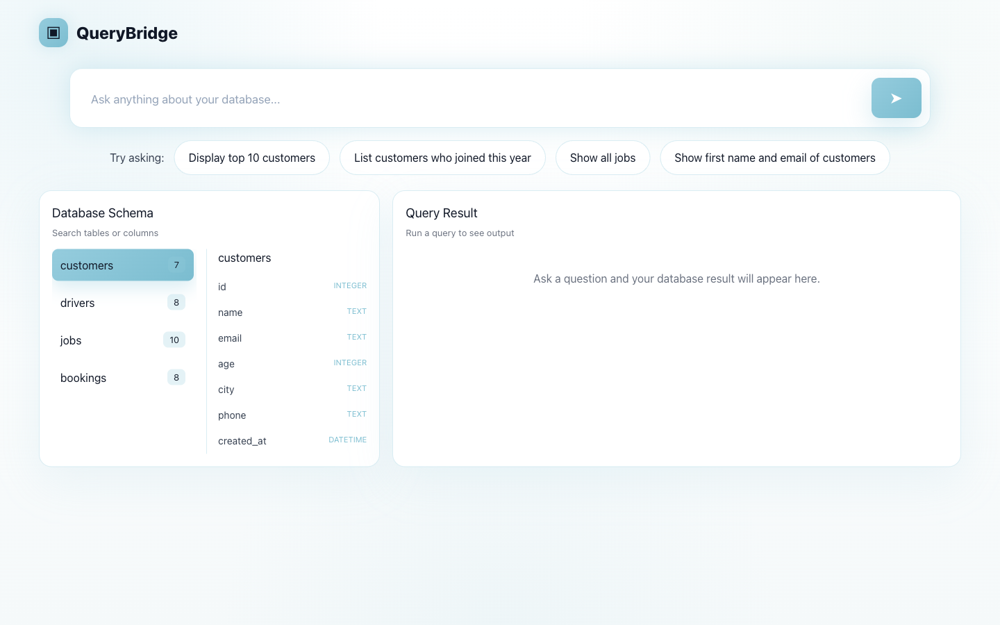
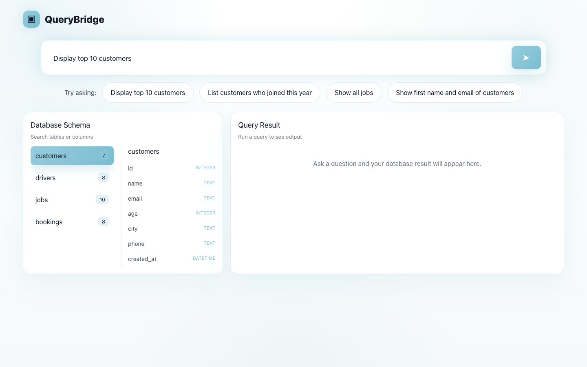
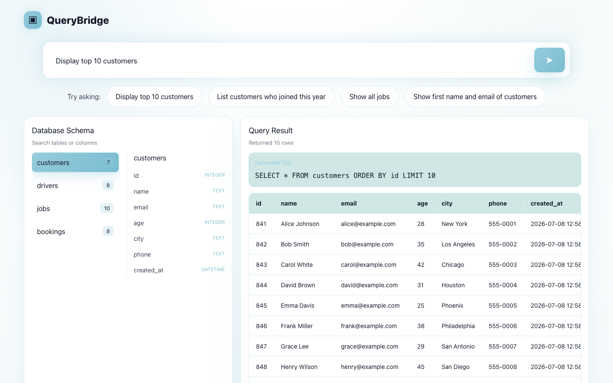

# QueryBridge

[](https://nodejs.org)
[](LICENSE)
[](https://github.com/mycabify/QueryBridge/pulls)

> Bridge the gap between people and data — ask questions in plain English, get SQL results instantly.

---

## ✨ Features

- **Natural Language to SQL** — Transform plain English into SQL queries instantly.
- **Schema-Aware AI** — Uses only your actual database schema. No invented tables or columns.
- **Secure Query Validation** — Every query is validated before execution to prevent unsafe operations.
- **SQL Preview** — Inspect generated SQL before running it.
- **Query History** — Save and revisit previous searches.
- **AI Explanations** — Understand what the generated query does in simple language.
- **Lightning Fast** — Powered by Groq for ultra-fast query generation.

---

## 🎬 Demo

<video src="docs/media/demo.mp4" autoplay loop muted playsinline poster="docs/media/step-1-landing.png" width="800"></video>

> **[▶ Watch demo video (MP4)](docs/media/demo.mp4)** — If the video does not play above, click to download and view locally.

QueryBridge lets you type a plain-English question, instantly generates a safe SQL query from your real database schema, shows you the SQL before it runs, and returns a clean results table — all in a few seconds without writing a single line of SQL yourself.

<table>
<tr>
<td align="center">

<br/><em>Step 1: Landing — empty query input box ready for your question.</em>
</td>
<td align="center">

<br/><em>Step 2: Input — natural language question typed into the query box.</em>
</td>
</tr>
<tr>
<td align="center">

<br/><em>Step 3: SQL Preview — AI-generated SQL query displayed before execution.</em>
</td>
<td align="center">

<br/><em>Step 4: Results — data table populated with query results.</em>
</td>
</tr>
</table>

### Updating Demo Media

To re-record the demo video or re-capture the workflow screenshots (e.g., after a UI change), follow these steps:

**Requirements:**
- Minimum screen/viewport: 1280 × 720 px (recommended: 1440 × 900 px)
- Target directory: `docs/media/`
- File naming convention (do not rename):
  - `step-1-landing.png` — empty query input box visible
  - `step-2-input.png` — natural-language question typed in the query box
  - `step-3-sql-preview.png` — Generated SQL panel visible after clicking Run
  - `step-4-results.png` — results table populated with data rows

**Capture the four workflow steps in order:**

1. **Step 1 — Landing:** The app is loaded and the query input box is empty. No SQL or results are shown.
2. **Step 2 — Input:** A natural-language question has been typed (e.g., "Display top 10 customers") but Run has not been clicked yet.
3. **Step 3 — SQL Preview:** The Run button has been clicked; the Generated SQL panel is visible with a SQL statement.
4. **Step 4 — Results:** The results table is fully populated with at least three rows of data.

**Using the capture scripts:**

```sh
# From the repository root, with both backend and frontend running:
npm run capture   # captures step-1-landing, step-2-input, step-3-sql-preview, step-4-results
npm run record    # records demo.mp4 (15–20 s) and converts to H.264 MP4
```

See `scripts/capture-screenshots.js` and `scripts/record-demo.js` for implementation details.

---

## 🔄 How It Works

```
User Question
      ↓
Read Database Schema
      ↓
Generate SQL with AI
      ↓
Validate Query
      ↓
Execute Safe SQL
      ↓
Return Results
```

**Example**

User input:
```
Show all customers younger than 40 from Karachi.
```

Generated SQL:
```sql
SELECT *
FROM customers
WHERE age < 40
  AND city = 'Karachi';
```

---

## 🛠 Tech Stack

| Layer | Technology |
|-------|-----------|
| **Frontend** | Next.js, Tailwind CSS, JavaScript |
| **Backend** | Node.js, Express.js |
| **Database** | SQLite |
| **AI** | Groq Cloud — Llama 3.3 70B Versatile |

---

## 📁 Folder Structure

```
QueryBridge/
├── backend/
│   └── src/
│       ├── config/         # DB + env configuration
│       ├── controllers/    # Route handlers
│       ├── database/       # SQLite schema & seed data
│       ├── middleware/     # Error handling
│       ├── routes/         # Express route definitions
│       ├── services/       # AI query generation, validation, execution
│       └── utils/          # Shared response helpers
├── docs/
│   └── media/              # Demo video and workflow screenshots
├── frontend/
│   └── app/                # Next.js app directory (page, layout, globals)
├── scripts/
│   ├── capture-screenshots.js   # Playwright screenshot script
│   ├── record-demo.js           # Playwright video recording script
│   └── process-video.sh         # FFmpeg trim/compress helper
└── README.md
```

---

## 🚀 Quick Start

**Prerequisites:** Node.js 18+, npm

```sh
# 1. Clone the repository
git clone https://github.com/mycabify/QueryBridge.git
cd QueryBridge

# 2. Install root devDependencies
npm install

# 3. Install backend dependencies
cd backend && npm install && cd ..

# 4. Install frontend dependencies
cd frontend && npm install && cd ..

# 5. Configure environment variables
cp backend/.env.example backend/.env
# Edit backend/.env and set GROQ_API_KEY=your_groq_api_key_here

# 6. Run backend (port 5000)
npm run dev --prefix backend

# 7. Run frontend (port 3000) — in a new terminal
PORT=3000 npm run dev --prefix frontend
```

Open [http://localhost:3000](http://localhost:3000) and start querying your database.

---

## 📡 API Reference

### `POST /api/query`

Convert a natural-language question to SQL and execute it.

**Request body:**
```json
{
  "query": "Show all customers younger than 40 from Karachi"
}
```

**Response:**
```json
{
  "success": true,
  "data": {
    "naturalLanguageQuery": "Show all customers younger than 40 from Karachi",
    "sql": "SELECT * FROM customers WHERE age < 40 AND city = 'Karachi';",
    "results": [...],
    "explanation": "This query retrieves all customers under 40 years old located in Karachi.",
    "rowCount": 12
  }
}
```

---

### `GET /api/schema`

Return the current database schema as a structured object.

**Response:**
```json
{
  "success": true,
  "data": {
    "schema": {
      "customers": {
        "id": "INTEGER",
        "name": "TEXT",
        "age": "INTEGER",
        "city": "TEXT"
      }
    }
  }
}
```

---

## ⚙️ Configuration

Set these variables in `backend/.env`:

| Variable | Description | Required |
|----------|-------------|----------|
| `GROQ_API_KEY` | Your Groq Cloud API key — used for AI query generation | Yes |

Get a free API key at [console.groq.com](https://console.groq.com).

---

## 🚢 Deployment

**Backend — Railway**

1. Create a new Railway project and connect your GitHub repo.
2. Set the root directory to `backend/`.
3. Add the `GROQ_API_KEY` environment variable in Railway's dashboard.
4. Railway auto-detects Node.js and runs `npm start`.

**Frontend — Vercel**

1. Import the repository into Vercel.
2. Set the root directory to `frontend/`.
3. Set the environment variable `NEXT_PUBLIC_API_URL` to your Railway backend URL.
4. Deploy — Vercel handles the Next.js build automatically.

---

## ⚡ Performance

- **Groq ultra-fast inference** — Llama 3.3 70B Versatile responses in under 500 ms on average.
- **Debounced input** — The frontend debounces keystrokes so AI calls only fire when the user stops typing.
- **Lazy loading** — The schema sidebar loads asynchronously on mount so the query box is interactive immediately.
- **Lightweight bundle** — No heavy ORM or runtime dependencies; SQLite queries run in-process.

---

## 🔒 Security

QueryBridge is designed with security first.

**Allowed operations:**
- `SELECT`

**Blocked operations:**
- `DELETE`
- `UPDATE`
- `INSERT`
- `DROP`
- `ALTER`

**Additional protections:**
- Schema validation — the AI is constrained to use only real tables and columns from your schema.
- Read-only execution — only SELECT queries are executed against the database.
- Query sanitization — generated SQL is validated before execution.
- No invented columns or tables — hallucinated identifiers are rejected.

---

## 🗺 Future Improvements

- [ ] Multi-database support (PostgreSQL, MySQL)
- [ ] User authentication and per-user query history
- [ ] Query explanation panel with step-by-step SQL breakdown
- [ ] Export results to CSV / Excel
- [ ] Saved queries with custom labels
- [ ] Voice input for natural-language queries
- [ ] Admin dashboard to monitor query usage and errors
- [ ] Support for read-only `JOIN` queries across multiple tables

---

## 🤝 Contributing

Contributions are welcome.

1. Fork the repository.
2. Create a feature branch: `git checkout -b feature/my-improvement`
3. Make your changes and add tests where appropriate.
4. Commit: `git commit -m "feat: describe your change"`
5. Push: `git push origin feature/my-improvement`
6. Open a pull request against `main`.

Please keep PRs focused and include a clear description of what changed and why.

---

## 📄 License

[MIT](LICENSE) — free to use, modify, and distribute.
